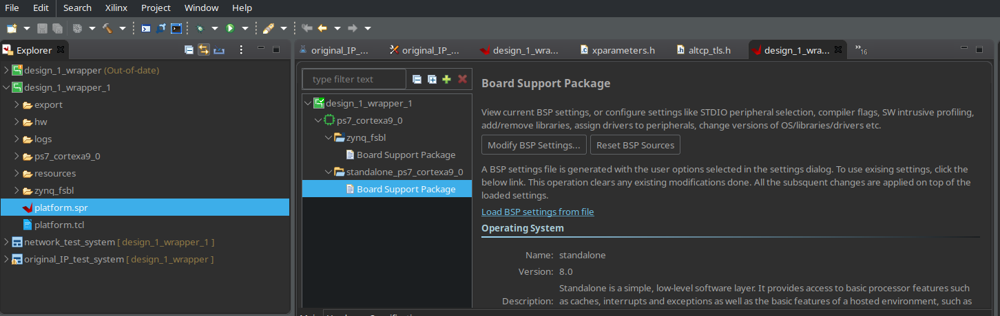
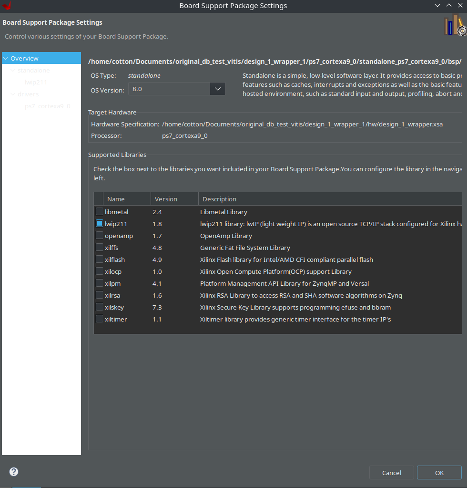

## はじめに

Vitis を xsct コマンドで使用する場合に、xilffs をビルドソースに含める方法を説明します。

ちなみに GUI からはすぐに設定できます。

spr ファイルを選択し、modify BSP settings を選択します。



次に、`xilffs` を選択します。これだけです。注意点として、`fsbl` ではなくて `cortexa9_0` の方の設定を変える必要があります。



## xsct での設定

xsct での設定は、以下のようにします。

```tcl
setws <workspace_path>
app create -name <project_name> -hw <path_to_xsa_file> -os standalone -proc ps7_cortexa9_0 -template {Empty Application(C)}

bsp setlib xilffs
platform generate
```

最後 2 行のコマンドが大切です。

`bsp setlib xilffs` で `xilffs` をビルドソースに追加します。
`platform generate` でビルドします。

`platform generate` を実行しないと、設定が反映されません。

他のライブラリも同様にできると思います。

## 参考

- [Error when build FSBL for zynq-7000 using xsct - Adaptive SoC & FPGA Support](https://adaptivesupport.amd.com/s/question/0D52E00007G0s6iSAB/wrong-fsbl-bsp-compilation-options-after-certain-sequences-of-xsct-commands-on-vitis-20202?language=en_US)
