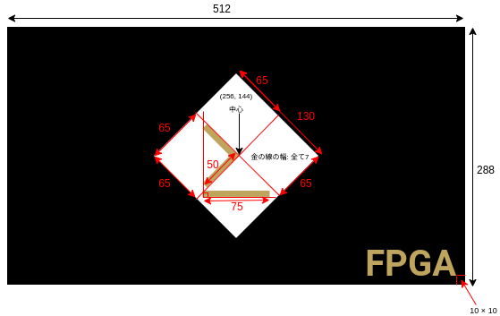
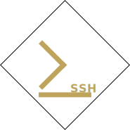

## あいさつ

こんにちは、Myxogastria0808 (Yuki Osada) です。

この度、my-wilinx-docsのロゴを作成しました。
以下、ロゴの作成過程や、設計図について記します。

<!-- truncate -->

## ロゴの作成過程

ロゴの作成は、以下のような過程で行いました。

1. **アイデア出し**: ロゴのテーマや色合いを考えました。my-xilinx-docsはFPGA × CLIをテーマにしているため、FPGAの要素とCLIの要素を組み合わせることを目指しました。
2. **スケッチ**: 手書きでいくつかのスケッチを描き、どのデザインが最も適しているかを検討しました。
3. **デジタル化**: スケッチを基に、デジタルツールを使用してロゴを作成しました。具体的には、inkscapeを使用しました。

## 設計図

以下が、ロゴの設計図です。

## 完成品

長方形のロゴと正方形のロゴを作成しました。

## おわりに

作成したロゴは、my-xilinx-docsのアイデンティティを視覚的に表現できたと思います。
my-xilinx-docが多くの方の目に留まり、読んでいただければ幸いです。
