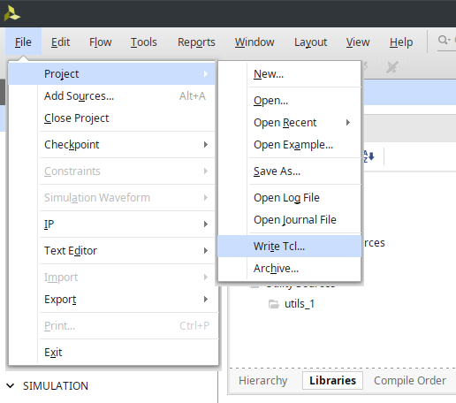

# まず動かしてみる

習うより慣れろということで、まずは Vivado の Batch Mode を試してみましょう。

## PATH が通っているか確認する

### Linux の場合

```sh
$ which vivado
/path/to/vivado
```

PATH が通っていない場合は、Vivado のインストール先の bin フォルダを PATH に追加してください。

### Windows の場合

Windows の場合は bat ファイルを実行することで起動するみたいです。

(例)

```sh
> "C:\Xilinx\Vivado\<version>\bin\vivado.bat"
```

## tcl スクリプトの生成

まずはプレーンなプロジェクトを作成してみましょう。

最終的には自分だけのスクリプトを作って管理していくのですが、とりあえずコマンドだけで動かす体験をしていただこうと思います。


Vivado を起動してから、Create Project で Project を作成。



作成できたら、*File -> Project -> Write Tcl*を選択。

Tcl の出力先はプロジェクトがあるディレクトリの一つ上(おそらくデフォルトの場所)にしてください。

出力された後のディレクトリ構造は project_1 という名前の project を作成した場合こうなります。

```sh
$ tree .
.
├── project_1
│   ├── project_1.cache
│   │   └── wt
│   │       └── project.wpc
│   ├── project_1.hw
│   │   └── project_1.lpr
│   ├── project_1.ip_user_files
│   └── project_1.xpr
└── project_1.tcl

5 directories, 4 files
```

すると 500 行程度のスクリプトが生成されるかと思います。これは Vivado が自動生成したファイルであり、このスクリプトを読み込むことで同じ環境を再現することができます。しかし、このファイルはプロジェクトの中で必要なパラメータを大量に設定しており、この先合成や配置配線をする上では必要のないパラメータ指定も多く存在します(大体はデフォルト値で動きます)。

## tcl スクリプトの実行

ではスクリプトを実行してみましょう。スクリプトを実行する際、元々あるプロジェクトファイルがあるとエラーを出力するため、一度**プロジェクトフォルダを削除しましょう**。

<details>
<summary>エラー出力例</summary>
<p>

```sh
$ vivado -mode batch -source project_1.tcl

****** Vivado v2022.2 (64-bit)
  **** SW Build 3671981 on Fri Oct 14 04:59:54 MDT 2022
  **** IP Build 3669848 on Fri Oct 14 08:30:02 MDT 2022
    ** Copyright 1986-2022 Xilinx, Inc. All Rights Reserved.

source project_1.tcl
# proc checkRequiredFiles { origin_dir} {
...
# create_project ${_xil_proj_name_} ./${_xil_proj_name_} -part xc7z020clg400-1
ERROR: [Common 17-53] User Exception: Project already exists on disk, please use '-force' option to overwrite:
     /home/cotton/Documents/wiki/project_1/project_1.xpr
     /home/cotton/Documents/wiki/project_1/project_1.cache
     /home/cotton/Documents/wiki/project_1/project_1.hw
     /home/cotton/Documents/wiki/project_1/project_1.ip_user_files
INFO: [Common 17-206] Exiting Vivado at Thu May  8 12:54:16 2025...
```

</p>
</details>

Linux の場合

```sh　
# rm -rf <project name>
$ vivado -mode batch -source <project name>.tcl
```

Windows の場合

```sh
# rmdir /s /q <project name>
> C:\Xilinx\Vivado\<version>\bin\vivado.bat -mode batch -source <project name>.tcl
```

すると、Vivado が起動し、スクリプトが実行されます。スクリプトの実行が終わると Vivado は終了します。

このスクリプトはプロジェクトを作成するだけのスクリプトのため、特に合成などは行われませんが、Vivado の GUI を開かずにプロジェクトを作成することができました。

## 参考

- [Vivado でプロジェクトを作る Tcl スクリプト #FPGA - Qiita](https://qiita.com/ikwzm/items/666dcf3b90c36d16a0ed)
- [Vivado で論理合成と配置配線を実行する Tcl スクリプト #FPGA - Qiita](https://qiita.com/ikwzm/items/36e5911c155c8303b705)
