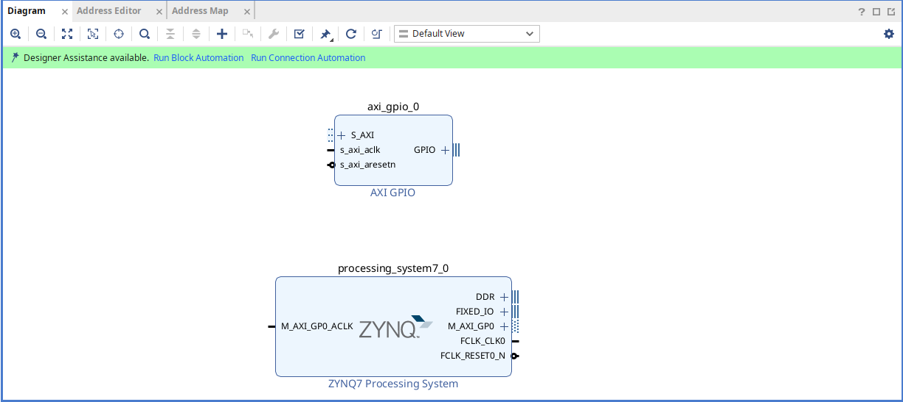
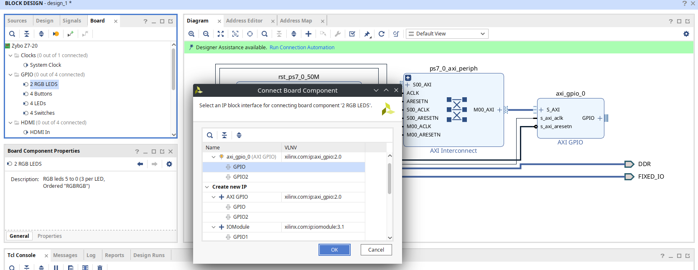
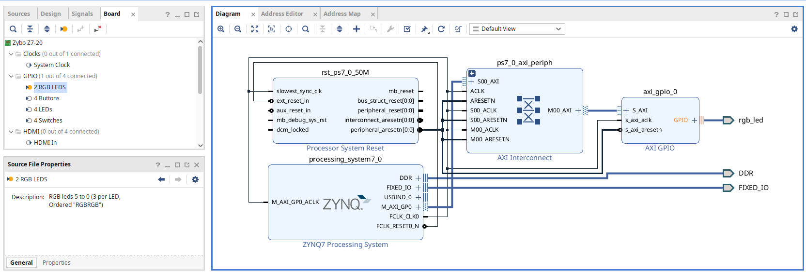
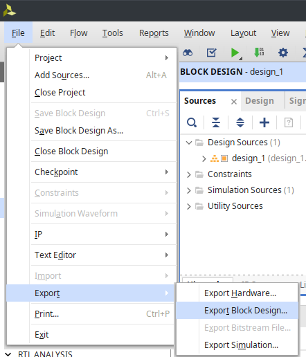
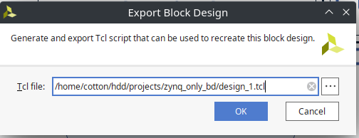

# プロジェクトの作成方法

Block Design の tcl を入手すれば、あとは`flow.tcl`を読み込むのみなので簡単に作成できます。

あらかじめ使用するボードの BSP を指定しておくと、物理的制約を追加する際に楽になります。

## モジュールの追加・配線

Vitis 側で L チカを行う前提で Block Design を作成するので、AXI_GPIO と ZYNQ7 Processing System を追加します。

自動配線は以上の様に行います。この時 GPIO の設定で Options から自動的に配線できるらしいです。ここで設定しても良いですが、しない場合は以下に説明するように設定することもできます。

## 物理的制約の追加

次に物理的制約を追加します。BSP を指定している場合は以下のように制約を設定できるかと思います。

ボードペインから接続したいピンをダブルクリックします。

設定に成功すると以下の様になるはずです。

## Block Design のエクスポート

Block Design ができたので、エクスポートします。

_File -> Export -> Export Block Design_

OK を押してエクスポートします。
