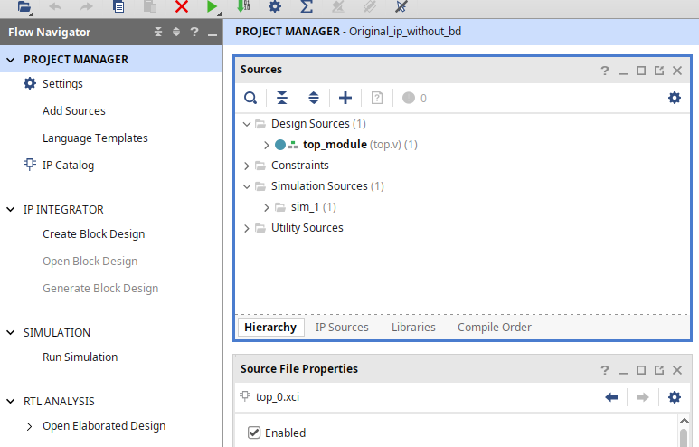
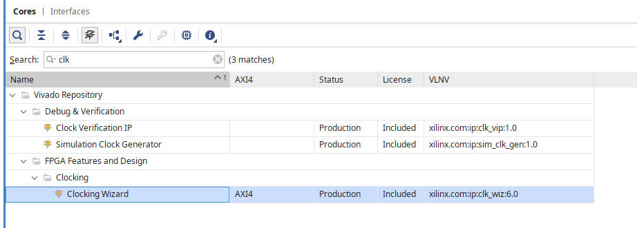
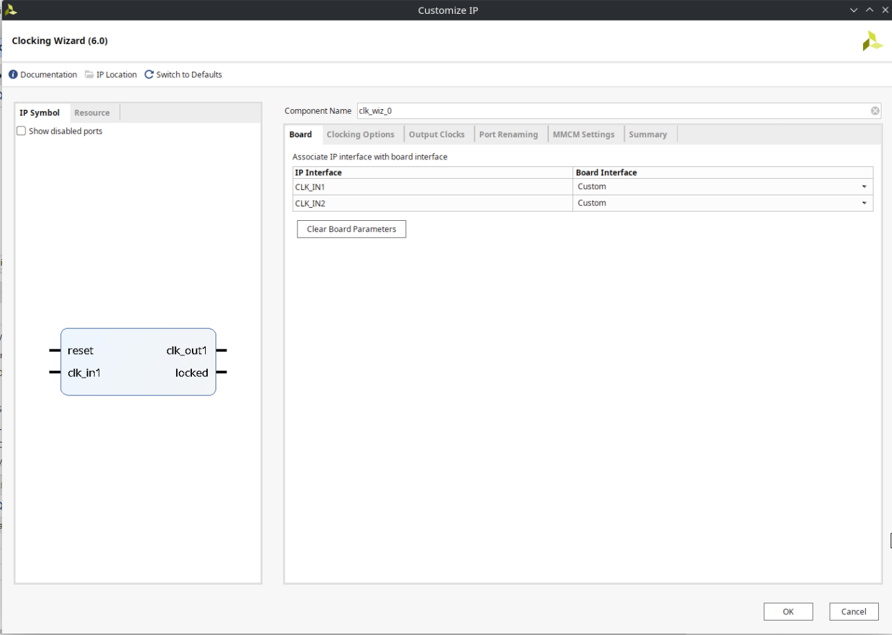

# プロジェクトの作成方法

前章で必要なファイルはわかったと思います。今度は自分でプロジェクトを作成してみましょう。

## 必要なものは`.xci`ファイルのみ

まず、前章で示したファイル構成を再掲します。

```sh
$ tree .
.
├── flow.tcl
├── README.md
└── src
    ├── constr # 制約ファイル
    │   └── zybo.xdc
    ├── hdl # HDLファイル
    │   ├── gen_1hz.sv
    │   └── top.sv
    └── ip # IPモジュール
        └── clk_core.xci

4 directories, 6 files
```

このディレクトリ構造はあくまでも一例であり、実際には自分の好きなように構成してもらっても問題ありません。

HDL のコードや`.xdc`ファイルについては、基本的に自分で用意する必要があります。
しかし、`.xci`ファイルは IP Catalog から IP を作成した際に自動生成されるファイルであるので、自分で用意することは不可能に近いです。コマンドでも作成できますが、設定漏れなどを考えた時に、GUI で作成した方が良いでしょう。
そのため、ここは*しょうがないですが*、GUI で作成していく必要があります。

以下では`.xci`ファイルを作成するための手順を説明します。

:::note

### `.xci`ファイルさえあれば GUI はいらない

`.xci`ファイルさえあれば、GUI を使わずにプロジェクトを作成することができます。
:::

## IP Integrator での IP の作成

まずは Vivado を起動し、適当なプロジェクトを作成します。



プロジェクトが作成できたら、画像左側の IP Catalog を開きます。



検索欄で clk と入力すると、`Clocking Wizard`が出てくるので、これをダブルクリックします。



この様な画面が出てくるので、Component Name を`clk_core`に変更します。`OK`を押すと、IP の設定画面が出てきます。そのあとはそのまま`Generate`を押して、IP を生成します。これで`clk_core.xci`が生成されます。

このファイルは project の`<project_name>/<project_name>.srcs/sources_1/ip/clk_core/`に格納されます。

これで`.xci`ファイルの準備は完了です。ファイルが取り出せたらプロジェクトを削除しても良いです。

:::tip

### デメリットもある

ファイルを取得するだけで良い一方で、一度エクスポートした IP を修正することは難しいため、IP の設定を変更したい場合は、再度作り直す必要があります。

なので、おおまかな実装は GUI で行い、途中から non Project Mode に移行するのも手だと思います。

私がこのドキュメントを書いている時も最低限の設定は GUI で行い、途中から non Project Mode に移行しています。

最初から使う IP が固定だったり、授業などで配布されている IP モジュールを使用する場合は、IP モジュールはいじらないことが前提の場合が多いため、最初から non Project Mode で行うのも良いかもしれません。
:::
