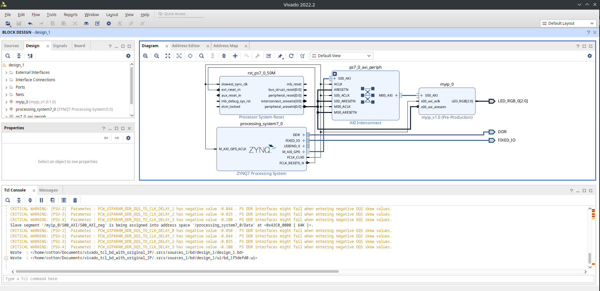

# プロジェクトの作成方法

Block Design の作成方法については書籍を参考にしてください。

## BLock Design のエクスポート

Block Design の作成ができたら、エクスポートします。エクスポートの方法は前章を確認ください。

## IP モジュールの抽出を行う

Block Design を作成したら、独自 IP モジュールを抽出します。

IP を作成したときに指定したディレクトリを**そのまま**プロジェクト配下にコピーします。

あとは今まで通り`flow.tcl`のパスの修正を読み込むだけです。Block Design の tcl は、使用できる IP モジュールを検索しますが 、パスを用いて検索していないため、修正は必要ありません。

:::tip

この様な独自モジュールを含む Block Design を作成した場合は、`source ./blockdesign/$design_name.tcl`前までのスクリプトを実行することで、Block Design を読み込むことができます。

```tcl
# 相対パスで指定する場合はcd で移動しておく
cd <path_to_block_design>


set current_dir [pwd]
create_project -in_memory
set obj [current_project]
set_property -name "board_part_repo_paths" -value "[file normalize [file join $env(HOME) ".Xilinx/Vivado/2022.2/xhub/board_store/xilinx_board_store"]]" -objects $obj
set_property -name "board_part" -value "digilentinc.com:zybo-z7-20:part0:1.0" -objects $obj
set_property -name "default_lib" -value "xil_defaultlib" -objects $obj

set_property board_part digilentinc.com:zybo-z7-20:part0:1.0 [current_project]
set_property -name "ip_repo_paths" -value "./ip/myip_1_0" -objects $obj

read_xdc ./src/const/test.xdc
import_ip ./src/ip/my_ip/design_1_myip_0_0.xci
upgrade_ip  -vlnv  user.org:user:myip:1.0 [get_ips design_1_myip_0_0]

set outputDir ./synth_tmp
file mkdir $outputDir

set design_name design_1

source ./blockdesign/$design_name.tcl
```

これを実行するだけで Block Design Editor が起動します。\
(ここでも既に`.srcs`ファイルが存在するとエラーを出すので注意が必要です。)

:::
